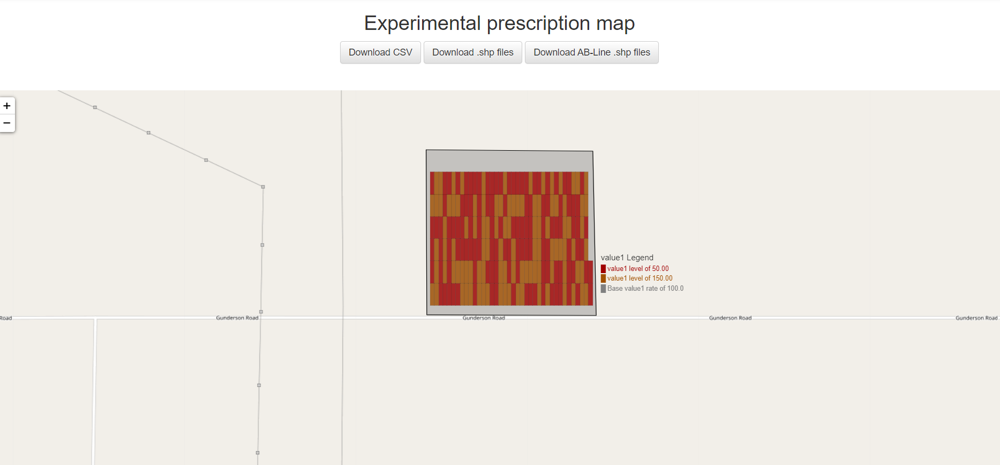
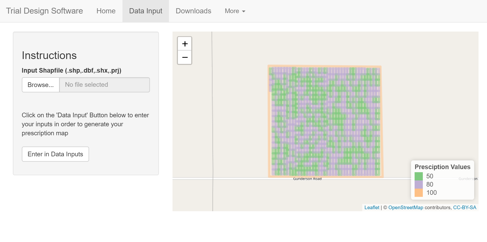
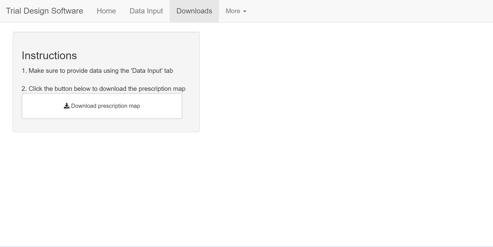
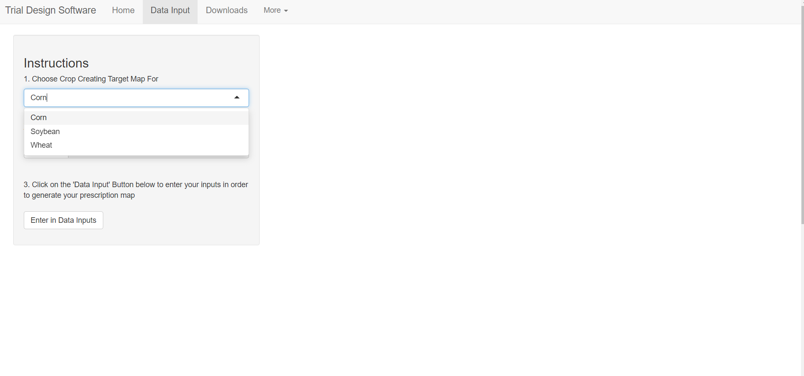

```{r setup, include=FALSE}
library(knitr)
knitr::opts_chunk$set(echo = FALSE)
```

## Outline

1. Overall Problem 
  + Background Information
  + Why this application is being created
2. Process of App Development
  + Creation of User Interface
  + Replication of Python App with the Reticulate Package=
  + Replication of R Markdown code
3. Shiny App Walkthrough
  
---

## Data Intensive Farm Managment Project (DIFM)

+ Precision Agriculture research seeks to develop new strategies to increase crop yield and profitability [[Source]](https://sustainableamerica.org/blog/what-is-precision-agriculture/)

+ Experiments on strategies can be conducted through on-farm networks, which involves farmers conducting experiments under local conditions

  - Generates site-specific data for crop yield for different inputs (think like treatments)

+ DIFM is a grant with the funding going towards running these on-farm precision experiments and developing infrastructure to do so.

---

## So What am I Doing?

+ Create a R Shiny application that will create the experimental design based on site-specific inputs the farmer enters.
  - Backend code is written in both R and Python (depends on the crop)
+ Farmer will enter inputs:
  - File that contains the coordinates of their field boundary
  - How big they desire their experimental plots to be
  - What treatment they desire to use and the different rates
  - Specifics about their tractor
  - Ab-line file 
+ Farmers will receive:
  + shp and ab-line files that they can put in their tractor in order to enact the experimental design on their field.
  
---

## End Goal

+ Eventually hook app up to their database and after harvest, crop yields can be matched with the corresponding farm and it's design.

+ Then the data can begin to be analyzed to hopefully aid in the development of strategies to increase profitability
---

## Outline of Developement Process

+ At first, goal was to Replicate a Python App already in use in Shiny
  - Start be creating UI similar to Python app
  - Connect R and Python
  - Figure out how to run the Python files
  - Find out later, best used for wheat field trials
+ Add R Markdown code to create design for corn/soybean trials

---

## Python App for Wheat Field Trials

Trying to Replicate a previously made Python App (website no longer active)

```{r, echo=FALSE,out.width="90%", out.height="90%",fig.cap="Python App Output",fig.show='hold',fig.align='center'}



``` 

---

## Replicating Python App in Shiny - Setting up UI

+ Setting up UI:
  - Create Leaflet map capability
  - Dialog Box for Inputs

```{r, echo=FALSE,out.width="50%", out.height="90%",fig.cap="Initial App",fig.show='hold',fig.align='center'}

knitr::include_graphics(c("images/TDS4.png","images/TDS2.png"))

``` 

---

## Add in Python Capability using Reticulate

+ What is Reticulate?
  - Let's say you are working on project where you need to use a mix of R and Python Functions

  - This package creates a R Interaface to Python and allows you to "easily" go back and forth between the two of them.
  
  - [Reticulate Website](https://rstudio.github.io/reticulate/index.html)

---

## What can Reticulate Do?

- Call Python from R in different ways

  + Source a Python script 
  
  + Use in R Markdown and R Shiny
  
  + Import Python modules
  
- Translate between R and Python Objects

- Create Python Virtual environments 

---

## Creating A Python Virtual Environment

If you are working on a project, you may want to create a python virtual environment (creates an isolated version of Python)

[Configuring a virtual environment from reticulate website](https://rstudio.github.io/reticulate/articles/versions.html)

[Basic Outline on how I did it](https://medium.com/co-learning-lounge/create-virtual-environment-python-windows-2021-d947c3a3ca78) (on Windows):
+ Create a Project in R Studio (File -> New Project)
+ Have Python installed on your computer
+ In Anaconda Prompt
 - conda create --name [Virtual Environment Name] python=[Version you want to install]
 - conda activate [Virtual Environment Name]
 - load all necessary Python packages in here (conda install pkge)
+ In R Studio, connect to Python Virtual Environment 
  + Tools -> Project Options -> Python -> Conda Environments
+ Check connection using: py_config()

---

## Complications with Reticulate

1. Installing Packages: [Requirements List](C:/Users/akleffner2/OneDrive - University of Nebraska-Lincoln/Documents/PrescriptionShinyTool/requirements.txt)
  - Had issues trying to install at once - install in chunks
  - Some packages required a wheel to be installed
  - Some packages would not install with pip command (would get a Windows Visual Studio Error) - but installing packages with conda worked 
  
2. Connecting Python
  - Kept trying to connect with a version of Python no longer installed on my machine
  - Solution: Installed an older version of Reticulate (Version 1.16-9000)

---

## Python Finally Connected to R: Now get Code to Run

+ Had Python files, so sourced them in app in order to get functions available. 
  - [source_python('field_creation.py')](C:/Users/akleffner2/OneDrive - University of Nebraska-Lincoln/Documents/PrescriptionShinyTool/UI/field_creation.py)
+ Created a list of Shiny Inputs that can pass into Python
+ Helpful Tip: Worked through getting Python code to run in just a R Script first
+ Ran below code to run the necessary Python code in the file

```{r, echo=TRUE, eval=FALSE}
result <- Field(id = 0, field_dict=field_dict) #main python class

result$create_field() #actual function to run (creates the field object)
```

---

## Python Output

```{r, echo=FALSE,out.width="100%", out.height="100%",fig.cap="Trial Design Output",fig.show='hold',fig.align='center'}



``` 

---

## Adding in Downloading Capabilities

```{r, echo=FALSE,out.width="70%", out.height="70%",fig.cap="Download Tab",fig.show='hold',fig.align='center'}



``` 

+ Files were created in a different file:
  - [source_python('fileIO.py')](C:/Users/akleffner2/OneDrive - University of Nebraska-Lincoln/Documents/PrescriptionShinyTool/UI/fileIO.py)
  
```{r, echo=TRUE, eval=FALSE}
req(filesDLD()) #reactive value for result object
write_map_to_files('prescription_map', field_ = filesDLD())
```

  
---

## R Markdown Code for Corn and Soybean Field Trials

+ Next code for creating Corn and Soybean field trials needed to be added to the app
+ Luckily this code was in R Markdown files
+ Now selecting desired crop will dictate which form is received and what field creation code will be ran
+ Working, but needs a lot of cleaning up

```{r, echo=FALSE,out.width="70%", out.height="70%",fig.cap="Choosing Crop",fig.show='hold',fig.align='center'}



``` 

---

## Now let's Actually Go to the App!

[Website](http://trialdesign.difm-cig.org/)

---

## Next Steps: App Beautification

+ Leaflet map for Corn/Soybean Code
+ Cleaning of Corn/Soybean Inputs
+ Layout of maps 
+ Testing to make sure code is working properly
+ Error handling for inputs 

---

## Questions?


