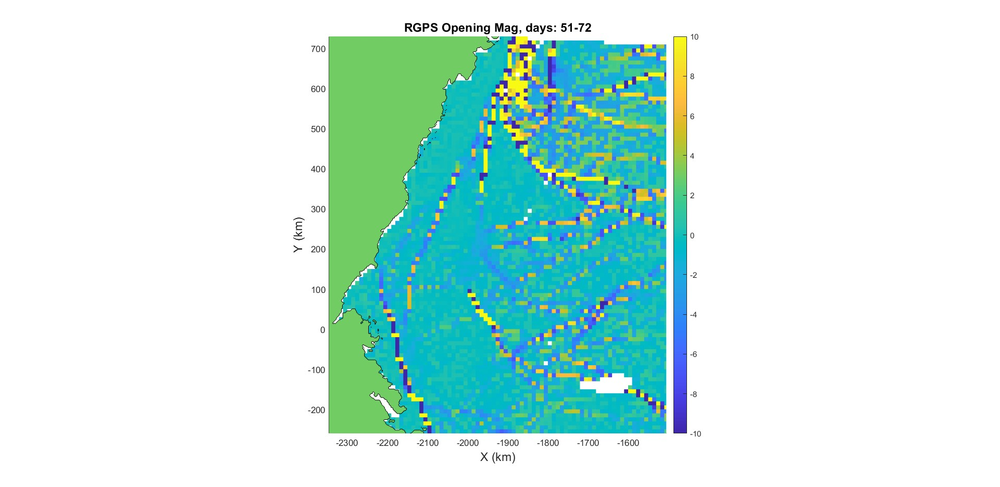

class:title-slide-custom

```{r, child = "style.Rmd"}
```


```{r setup, echo = FALSE, message = FALSE, warning = FALSE}
# Packages
library(emoji)
library(purrr)
library(tidyverse)
library(gridExtra)
library(nullabor)
library(scales)
library(knitr)
library(kableExtra)
library(RefManageR)
library(iconr)
library(fontawesome)
library(shiny)
library(fields)
library(crosstalk)
library(plotly)
library(bibtex)
# download_fontawesome()

# References
bib <- ReadBib("bib/thesis.bib", check = FALSE)
ui <- "- "

# R markdown options
knitr::opts_chunk$set(echo = FALSE, 
                      message = FALSE, 
                      warning = FALSE, 
                      cache = TRUE,
                      dpi = 300)
options(htmltools.dir.version = FALSE)
options(knitr.kable.NA = '')

```

```{r, include = F, eval = T, cache = T}
clean_file_name <- function(x) {
  basename(x) %>% str_remove("\\..*?$") %>% str_remove_all("[^[A-z0-9_]]")
}
img_modal <- function(src, alt = "", id = clean_file_name(src), other = "") {
  
  other_arg <- paste0("'", as.character(other), "'") %>%
    paste(names(other), ., sep = "=") %>%
    paste(collapse = " ")
  
  js <- glue::glue("<script>
        /* Get the modal*/
          var modal{id} = document.getElementById('modal{id}');
        /* Get the image and insert it inside the modal - use its 'alt' text as a caption*/
          var img{id} = document.getElementById('img{id}');
          var modalImg{id} = document.getElementById('imgmodal{id}');
          var captionText{id} = document.getElementById('caption{id}');
          img{id}.onclick = function(){{
            modal{id}.style.display = 'block';
            modalImg{id}.src = this.src;
            captionText{id}.innerHTML = this.alt;
          }}
          /* When the user clicks on the modalImg, close it*/
          modalImg{id}.onclick = function() {{
            modal{id}.style.display = 'none';
          }}
</script>")
  
  html <- glue::glue(
     " <!-- Trigger the Modal -->

<!-- The Modal -->
<div id='modal{id}' class='modal'>
  <!-- Modal Content (The Image) -->
  
  <!-- Modal Caption (Image Text) -->
  <div id='caption{id}' class='modal-caption'></div>
</div>
"
  )
  write(js, file = "js-addins.html", append = T)
  return(html)
}
# Clean the file out at the start of the compilation
write("", file = "js-addins.html")
```

<br><br><br>
## A Spatio-Temporal Model for Arctic Sea Ice
### Joint Statistical Meetings, August 2022
#### Alison Kleffner, Yawen Guan, Susan VanderPlas
#### Department of Statistics, University of Nebraska - Lincoln
##### `r fa("envelope", fill = "black")` [akleffner@huskers.unl.edu](akleffner@huskers.unl.edu)
##### `r fa("home", fill = "black")` [https://alison-kleffner.netlify.app/](https://alison-kleffner.netlify.app/)
##### `r fa("github", fill = "black")` [alisonkleffner](https://github.com/alisonkleffner)
<br><br>
.medium[*Slides: https://alisonkleffner.github.io/presentations/JSM_2022/index.html#1]

---
class: primary
# Motivation 

+ Sea ice is frozen sea water that generally occurs as an ice pack which can drift over the oceans surface
+ Cracks, or leads, may form in the ice pack due to dynamic processes
  - Allows for heat from the ocean to be transferred to the atmosphere - accounts for part of the heat flux between the ocean and the atmosphere `r Citep(bib[[c("schreyer_ice_2006")]])`. 
+ Other Ice Crack Detection Methods
  - Involve the use of thermal images or deformation calculations found through satellite images
    + Satellite images have drawbacks of being low in resolution and are effected by atmospheric conditions, thus may lead to inaccurate calculations

```{r, fig.height=4}


```

---
class:primary
# Trajectory Plot

```{r traj-plot, fig.height=5}

datn = read.delim("data/lagrange_n.dat",sep="")
gpidn = unique(datn[,1]) #3364
colnames(datn) <- c("gpid","k","obs_time","xmap","ymap")
datn["location"] <- rep("n", 51926)
dato = read.delim("data/lagrange_o.dat",sep="")
gpido = unique(dato[,1]) #1941
colnames(dato) <- c("gpid","k","obs_time","xmap","ymap")
dato["location"] <- rep("o", 26106)
datp = read.delim("data/lagrange_p.dat",sep="")
gpidp = unique(datp[,1]) #2034
colnames(datp) <- c("gpid","k","obs_time","xmap","ymap")
datp["location"] <- rep("p", 26382)
datq = read.delim("data/lagrange_q.dat",sep="")
gpidq = unique(datq[,1]) #1472
colnames(datq) <- c("gpid","k","obs_time","xmap","ymap")
datq["location"] <- rep("q", 21033)

dat <- rbind(datn, dato, datp, datq)
gpid=unique(dat[,1]) #8811
n = length(gpid)
dat$t = floor(dat$obs_time) 
t = sort(unique(dat[,"t"]))
dat_time = split(dat,dat[,"t"]) 
tmp <- map2_df(dat_time, 1:length(dat_time), function(x, y) mutate(x, i = y))


colnames(tmp) <- c("gpid", "k", "obs_time", "x", "y", "location", "t", "i") #Why did I do this?

tmp2 <- tmp %>% highlight_key(~gpid)

ggplot(tmp2, aes(x = x, y = y, group = gpid, 
                      hoverinfo = NULL,
                      color = factor(gpid %% 10))) + 
  geom_path(arrow = arrow(length = unit(1, "mm")), alpha = .5) + 
  scale_color_viridis_d()
```

---
class:primary
# Our Method: Overview

+ Bounding Box Clustering Method
  - Uses movement features of trajectory to group like movements
  - Boundaries of clusters would be where potential clusters would form
+ Intersection Interpolation Method 
  - Due to data collection method, tend to be missing data in chunks
  - Uses spatio-temporal neighbors of missing data using defined clusters
  


---
class:primary
# Results : Bounding Box Clustering
```{r, fig.height=4.5}

bbox_summary <- function(df) {
  # Function takes data frame with k, xmap, ymap
  # and returns a bounding box and trajectory
  df <- arrange(df, k) # sort by k
  df %>%
    summarize(
      x = mean(xmap), y = mean(ymap),
      xmin = min(xmap), xmax = max(xmap),
      ymin = min(ymap), ymax = max(ymap),
      xbox = xmax - xmin,
      ybox = ymax - ymin,
      dx = xmap[n()] - xmap[1],
      dy = ymap[n()] - ymap[1],
      angle = atan2(dy, dx),
      kmin = min(k),
      kmax = max(k),
      npts = n(),
    )
}

colnames(tmp) <- c("gpid", "k", "obs_time", "xmap", "ymap", "location", "t", "i")

tmp_features<- tmp %>% 
  tidyr::nest(data = -gpid) %>% 
  mutate(summary = map(data, bbox_summary)) %>%
  unnest(summary)
#Standardize Variables
data_scale = data.frame(scale(tmp_features[,3:13]))

names(data_scale) <- c("x_s", "y_s", "xmin_s", "xmax_s", "ymin_s", "ymax_s", "xbox_s", "ybox_s", "dx_s", "dy_s", "angle_s")

tmp_features_s= data.frame(tmp_features, data_scale)
tmp_features_s = tmp_features_s[,-c(3:13)]

km= kmeans(select(tmp_features_s, c(x_s,y_s,xbox_s:angle_s)), 5, nstart=25)
cluster_K = as.factor(km$cluster)

tmp_features_km = data.frame(tmp_features_s, cluster_K)

anim_plot_data <- tmp %>%
  left_join(select(tmp_features_km, gpid, clust = cluster_K)) %>%
  mutate(imputed = F) %>%
  complete(crossing(gpid, t), fill = list(imputed = T)) %>%
  ungroup() %>%
  arrange(gpid, t) %>%
  group_by(gpid) %>%
  fill(xmap, ymap, matches("clust"), .direction = "downup") %>%
  arrange(gpid)

anim_plot_data51 <- filter(anim_plot_data, t==72)

anim_plot <- anim_plot_data51 %>%
  ggplot(aes(x = xmap, y = ymap, frame = t, group = gpid, ids = gpid,
             color = clust, fill = clust, shape = imputed)) + 
  geom_point() + 
  scale_shape_manual("Imputed", values = c("FALSE" = 15, "TRUE" = 0)) + 
  scale_color_viridis_d() + 
  scale_fill_viridis_d() + ggtitle("Clustering using all data on last day")

anim_plot

```


---
class: primary
# Results: Intersection Interpolation

```{r}
result_cluster1_ice <- data.frame(Cluster = c(1,2,3,4,5,6), X1 = c(3.14, 4.36, 2.64, 3.006,3.95,3.12), Y1 = c(4.27, 4.62, 3.13, 2.87, 3.56, 3.08), X2 <- c(3.19, 0.187, 1.314, 1.396, 0.74, 1.876), Y2 <- c(13.04, 0.356, 3.07, 2.44, 3.036, 5.459))
#
kableExtra::kable(result_cluster1_ice, booktabs = TRUE, caption = "RMSE by Cluster for Week 1 for Interpolation Methods", col.names = c("Cluster", "$X_{int}$", "$Y_{int}$", "$X_{lin}$", "$Y_{lin}$"), escape = FALSE) %>%
  add_header_above(c(" ", "Intersection" = 2, "Linear" = 2))
```


---
class:inverse
<br>
<br>
<br>
.center[
# Questions?
<br>
<br>
`r fa("envelope", fill = "white")` **akleffner@huskers.unl.edu**
`r fa("github", fill = "white")` **alisonkleffner**

```{r, out.height= "65%"}
knitr::include_graphics("images/frame.png")
```


]
