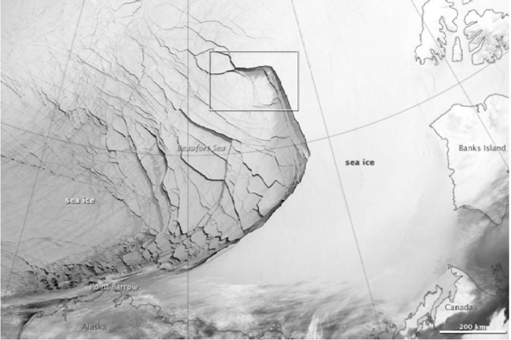
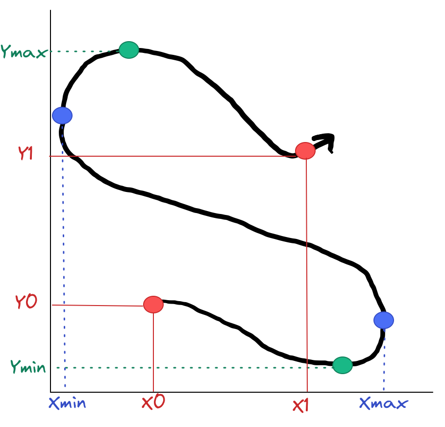

class:title-slide-custom

```{r, child = "style.Rmd"}
```


```{r setup, echo = FALSE, message = FALSE, warning = FALSE}
# Packages
library(emoji)
library(purrr)
library(tidyverse)
library(gridExtra)
library(nullabor)
library(scales)
library(knitr)
library(kableExtra)
library(RefManageR)
library(iconr)
library(fontawesome)
library(shiny)
library(fields)
library(crosstalk)
library(plotly)
library(bibtex)
library(gridExtra)
# download_fontawesome()

# References
bib <- ReadBib("bib/thesis.bib", check = FALSE)
ui <- "- "

# R markdown options
knitr::opts_chunk$set(echo = FALSE, 
                      message = FALSE, 
                      warning = FALSE, 
                      cache = TRUE,
                      dpi = 300)
options(htmltools.dir.version = FALSE)
options(knitr.kable.NA = '')

```

```{r, include = F, eval = T, cache = T}
clean_file_name <- function(x) {
  basename(x) %>% str_remove("\\..*?$") %>% str_remove_all("[^[A-z0-9_]]")
}
img_modal <- function(src, alt = "", id = clean_file_name(src), other = "") {
  
  other_arg <- paste0("'", as.character(other), "'") %>%
    paste(names(other), ., sep = "=") %>%
    paste(collapse = " ")
  
  js <- glue::glue("<script>
        /* Get the modal*/
          var modal{id} = document.getElementById('modal{id}');
        /* Get the image and insert it inside the modal - use its 'alt' text as a caption*/
          var img{id} = document.getElementById('img{id}');
          var modalImg{id} = document.getElementById('imgmodal{id}');
          var captionText{id} = document.getElementById('caption{id}');
          img{id}.onclick = function(){{
            modal{id}.style.display = 'block';
            modalImg{id}.src = this.src;
            captionText{id}.innerHTML = this.alt;
          }}
          /* When the user clicks on the modalImg, close it*/
          modalImg{id}.onclick = function() {{
            modal{id}.style.display = 'none';
          }}
</script>")
  
  html <- glue::glue(
     " <!-- Trigger the Modal -->

<!-- The Modal -->
<div id='modal{id}' class='modal'>
  <!-- Modal Content (The Image) -->
  
  <!-- Modal Caption (Image Text) -->
  <div id='caption{id}' class='modal-caption'></div>
</div>
"
  )
  write(js, file = "js-addins.html", append = T)
  return(html)
}
# Clean the file out at the start of the compilation
write("", file = "js-addins.html")
```

<br><br><br>
## A Spatio-Temporal Model for Arctic Sea Ice
### Joint Statistical Meetings, August 2022
#### Alison Kleffner, Susan VanderPlas, Yawen Guan
#### Department of Statistics, University of Nebraska - Lincoln
##### `r fa("envelope", fill = "black")` [akleffner@huskers.unl.edu](akleffner@huskers.unl.edu)
##### `r fa("home", fill = "black")` [https://alison-kleffner.netlify.app/](https://alison-kleffner.netlify.app/)
##### `r fa("github", fill = "black")` [alisonkleffner](https://github.com/alisonkleffner)
<br><br>
.medium[*Slides: https://alisonkleffner.github.io/presentations/JSM_2022/index.html#1]

---
class: primary
# Goal: Sea Ice Crack Detection 

+ Sea ice is frozen sea water that can occur as an ice pack which drifts over the oceans surface
+ Cracks, or leads, may form in the ice pack due to dynamic processes
  - Allows for heat from the ocean to be transferred to the atmosphere `r Citep(bib[[c("schreyer_elastic_2006")]])`. 
+ Other Ice Crack Detection Methods
  - Involve the use of thermal images or deformation calculations found through satellite images `r Citep(bib[[c("key_detectability_1993", "peterson_evaluating_2011")]])`.
    + Satellite images can be low in resolution and are affected by atmospheric conditions `r Citep(bib[[c("willmes_pan-arctic_2015")]])`

```{r, fig.align='center',  out.width="60%"}


```

---
class:primary
# Method Motivation: Trajectory Plot

```{r traj-plot, fig.height=5, cache = TRUE, fig.align='center'}

datn = read.delim("data/lagrange_n.dat",sep="")
gpidn = unique(datn[,1]) #3364
colnames(datn) <- c("gpid","k","obs_time","xmap","ymap")
datn["location"] <- rep("n", 51926)
dato = read.delim("data/lagrange_o.dat",sep="")
gpido = unique(dato[,1]) #1941
colnames(dato) <- c("gpid","k","obs_time","xmap","ymap")
dato["location"] <- rep("o", 26106)
datp = read.delim("data/lagrange_p.dat",sep="")
gpidp = unique(datp[,1]) #2034
colnames(datp) <- c("gpid","k","obs_time","xmap","ymap")
datp["location"] <- rep("p", 26382)
datq = read.delim("data/lagrange_q.dat",sep="")
gpidq = unique(datq[,1]) #1472
colnames(datq) <- c("gpid","k","obs_time","xmap","ymap")
datq["location"] <- rep("q", 21033)

dat <- rbind(datn, dato, datp, datq)
gpid=unique(dat[,1]) #8811
n = length(gpid)
dat$t = floor(dat$obs_time) 
t = sort(unique(dat[,"t"]))
dat_time = split(dat,dat[,"t"]) 
tmp <- map2_df(dat_time, 1:length(dat_time), function(x, y) mutate(x, i = y))


colnames(tmp) <- c("gpid", "k", "obs_time", "x", "y", "location", "t", "i") #Why did I do this?

tmp2 <- tmp %>% highlight_key(~gpid)

ggplot(tmp2, aes(x = x, y = y, group = gpid, 
                      hoverinfo = NULL,
                      color = factor(gpid %% 10))) + 
  geom_path(arrow = arrow(length = unit(1, "mm")), alpha = .5) + 
  scale_color_viridis_d() + theme(legend.position="none")
```

---
class:primary
# Our Proposed Methods: Overview

+ Bounding Box Clustering Method - Find Cracks:
  - Uses movement features of trajectory to group similar trajectories
  - Boundaries of clusters - location of potential ice cracks
- Intersection Interpolation Method:
  - Due to data collection method, data tends to be missing in chunks
  - Uses spatio-temporal neighbors of missing data 
      + Spatio-Temporal Neighbors are found using the clusters
```{r plots, cache=TRUE, fig.align='center', fig.cap="Picture of different features of our Bounding Box"}

```

---
class:primary
# References
<font size="2">
```{r, print_refs1, results='asis', echo=FALSE, warning=FALSE, message=FALSE}
print(bib[[c("key_detectability_1993", "peterson_evaluating_2011", "schreyer_elastic_2006", "willmes_pan-arctic_2015")]], 
      .opts = list(check.entries = FALSE, style = "html", bib.style = "authoryear")
      )
```
</font>

---
class:inverse
<br>
<br>
<br>
.center[
# Questions?
<br>
<br>
`r fa("envelope", fill = "white")` **akleffner@huskers.unl.edu**
`r fa("github", fill = "white")` **alisonkleffner**

```{r, out.height= "65%"}

```


]

