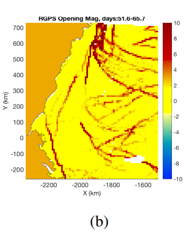

```{r setup, include=FALSE}
knitr::opts_chunk$set(echo = FALSE, warning = FALSE, message = FALSE, cache = TRUE)

```

### Seminar Agenda 

* Introduction to Problem and Data Set
* Previous Methods
* Our proposed Method: Bounding Box Approach
* Interpolation of Missing Data
* Future Work

---

### Project 1: Arctic Sea Ice Feature Detection


```{r, echo=FALSE,out.width="50%", out.height="20%",fig.cap="Figures of Ice Cracks",fig.show='hold',fig.align='center', fig.height=3}
library(knitr)

knitr::include_graphics(c("images/Ice Chunk.png","images/Ice Pic.png"))

``` 

---

### Motivation
+ What are We trying to Do?
  - Develop a method to determine where possible Ice Cracks may form given only movement data
+ Data Given
  - Gpid: Identify of part of ice chunk
  - Location of gpids (x/y)
  - Observation Time: Have 22 days worth of data
  - k: image index (sometimes will have multiple observations for a gpid on a day)

---
  
### Sea Ice Motion Animation

```{r, echo=FALSE,out.width="50%", out.height="30%",fig.cap="Ice Motion",fig.show='hold',fig.align='center'}

knitr::include_graphics(c("images/day1.png","images/day11.png","images/day16.png","images/day19.png"))
``` 

---

### Explanation of Problem

```{r trajectories, echo=FALSE, message=FALSE, cache=TRUE, fig.align='center'}
library(fields)
library(tidyverse)
library(crosstalk)
library(plotly)

datn = read.delim("C:/Users/akleffner2/OneDrive - University of Nebraska-Lincoln/ice-features/Code/Data/lagrange_n.dat",sep="")
gpidn = unique(datn[,1]) #3364
colnames(datn) <- c("gpid","k","obs_time","xmap","ymap")
datn["location"] <- rep("n", 51926)
dato = read.delim("C:/Users/akleffner2/OneDrive - University of Nebraska-Lincoln/ice-features/Code/Data/lagrange_o.dat",sep="")
gpido = unique(dato[,1]) #1941
colnames(dato) <- c("gpid","k","obs_time","xmap","ymap")
dato["location"] <- rep("o", 26106)
datp = read.delim("C:/Users/akleffner2/OneDrive - University of Nebraska-Lincoln/ice-features/Code/Data/lagrange_p.dat",sep="")
gpidp = unique(datp[,1]) #2034
colnames(datp) <- c("gpid","k","obs_time","xmap","ymap")
datp["location"] <- rep("p", 26382)
datq = read.delim("C:/Users/akleffner2/OneDrive - University of Nebraska-Lincoln/ice-features/Code/Data/lagrange_q.dat",sep="")
gpidq = unique(datq[,1]) #1472
colnames(datq) <- c("gpid","k","obs_time","xmap","ymap")
datq["location"] <- rep("q", 21033)

dat <- rbind(datn, dato, datp, datq)
gpid=unique(dat[,1]) #8811
n = length(gpid)
dat$t = floor(dat$obs_time) 
t = sort(unique(dat[,"t"]))
dat_time = split(dat,dat[,"t"]) 
tmp <- map2_df(dat_time, 1:length(dat_time), function(x, y) mutate(x, i = y))

colnames(tmp) <- c("gpid", "k", "obs_time", "x", "y", "location", "t", "i") #Why did I do this?

tmp2 <- tmp %>% highlight_key(~gpid)

ggplot(tmp2, aes(x = x, y = y, group = gpid, 
                      hoverinfo = NULL,
                      color = factor(gpid %% 10))) + 
  geom_path(arrow = arrow(length = unit(1, "mm")), alpha = .5) + 
  scale_color_viridis_d()

#ggplotly(p1, hoverInfo = "none") %>%
 # animation_opts(1000, redraw = FALSE) %>%
  #highlight(on = "plotly_hover", off = "plotly_doubleclick")


```

---

### Comparison: Previous Work by Guan et al (2019)

+ There is another dataset that has more information (like derivations of estimates of ice deformation)
+ Then they ran a kinematic analysis of the deformations.
  - Fit a jump in displacement that would account for the observed deformation in a cell.
  - So gives some indication of where cracks may form, and the level of opening of the crack.

---

### Overview: Spatio-Temporal Clustering

+ Ansari et. al (2019)
  - Event Clustering
  - Geo-Referenced data item clustering
  - Geo-Referenced time series clustering
  - Trajectory Clustering (Focus)
  - Moving Clusters
  - Semantic Based Trajectory Mining
+ Clustering of sub-trajectories (Lee et al (2007))

---

### Challenges

+ How gpids are laid out (can't use density-based clustering)
+ Missing chunks of data (issues with calculations of distances)
+ Only motion data is observed
+ Typical interpolation methods aren't suitable
  - Non-smooth spatial process
  - Nonstationarity due to ice moving as patches. 

---

### Our Proposed Method

+ Cluster similar trajectories to identify patches of ice using information from a Bounding Box
  - A way to work around the missing data problem
+ Space-time interpolation within each ice pack where ice movements are similar. 

---

### Clustering with Bounding Box

+ Included in Bounding Box
  - Min/Max Latitude
  - Min/Max Longitude
  - Average Lat/Long
  - Length of Latitude
  - Length of Longitude
  - Angle/Direction Moved
+ Use the features of the bounding box as inputs into KMeans Clustering
  - The boundaries of each cluster would be where the ice crack forms
  - The number of clusters was determined using the silhouette statistic 
 
---
  
### Results: Bounding Box of All Days

```{r clustering_at_51, echo=FALSE, message=FALSE, cache=TRUE, fig.align='center'}
colnames(tmp) <- c("gpid", "k", "obs_time", "xmap", "ymap", "location", "t", "i")

bbox_summary <- function(df) {
  # Function takes data frame with k, xmap, ymap
  # and returns a bounding box and trajectory
  df <- arrange(df, k) # sort by k
  df %>%
    summarize(
      x = mean(xmap), y = mean(ymap),
      xmin = min(xmap), xmax = max(xmap),
      ymin = min(ymap), ymax = max(ymap),
      xbox = xmax - xmin,
      ybox = ymax - ymin,
      dx = xmap[n()] - xmap[1],
      dy = ymap[n()] - ymap[1],
      angle = atan2(dy, dx),
      kmin = min(k),
      kmax = max(k),
      npts = n(),
    )
}

tmp_features<- tmp %>% 
  tidyr::nest(data = -gpid) %>% 
  mutate(summary = map(data, bbox_summary)) %>%
  unnest(summary)
#Standardize Variables
data_scale = data.frame(scale(tmp_features[,3:13]))

names(data_scale) <- c("x_s", "y_s", "xmin_s", "xmax_s", "ymin_s", "ymax_s", "xbox_s", "ybox_s", "dx_s", "dy_s", "angle_s")

tmp_features_s= data.frame(tmp_features, data_scale)
tmp_features_s = tmp_features_s[,-c(3:13)]

km= kmeans(select(tmp_features_s, c(x_s,y_s,xbox_s:angle_s)), 8, nstart=25)
cluster_K = as.factor(km$cluster)

tmp_features_km = data.frame(tmp_features_s, cluster_K)

anim_plot_data <- tmp %>%
  left_join(select(tmp_features_km, gpid, clust = cluster_K)) %>%
  mutate(imputed = F) %>%
  complete(crossing(gpid, t), fill = list(imputed = T)) %>%
  ungroup() %>%
  arrange(gpid, t) %>%
  group_by(gpid) %>%
  fill(xmap, ymap, matches("clust"), .direction = "downup") %>%
  arrange(gpid)

anim_plot_data51 <- filter(anim_plot_data, t==51)

anim_plot <- anim_plot_data51 %>%
  ggplot(aes(x = xmap, y = ymap, frame = t, group = gpid, ids = gpid,
             color = clust, fill = clust, shape = imputed)) + 
  geom_point() + 
  scale_shape_manual("Imputed", values = c("FALSE" = 15, "TRUE" = 0)) + 
  scale_color_viridis_d() + 
  scale_fill_viridis_d() + ggtitle("KMeans Clustering at t=51")

anim_plot


```

---

### Comparison to Yawen's Previous Work

```{r, echo=FALSE,out.width="60%", out.height="60%",fig.cap="RGPS opening magnitude from the kinematic algorithm",fig.show='hold',fig.align='center'}




``` 

---

### Results: Bounding Box By Week

```{r, echo=FALSE,out.width="50%", out.height="30%",fig.cap="Clustering Bounding Boxes by Week",fig.show='hold',fig.align='center'}

knitr::include_graphics(c("images/week1.png","images/week2.png","images/week3.png"))
``` 

---

### Next: Interpolation of Missing Information

+ Want to be able to interpolate the missing x/y gpid information
  - Challenges:
    + When missing gpid information, missing it in chunks
    + For spatial- temporal interpolation, in order to calculate the distance matrix, need latitude and longitude. 
+ Our Method: Use of Polygon Intersections
  - Find Spatial and temporal neighbors and use these to interpolate onto a grid

---
  
### Interpolation Process

+ Find Spatial-Temporal Neighbor groupings for each week.
  - Created Polygons for each week of the Clusters given previous (spatial neighbors)
  - Find intersection of polygons for the different weeks (temporal neighbors)
+ Develop a grid for starting values if missing.
+ At a time point, find the known data, and use this to develop a model using fit_model in the GpGp package
  - Exponential Space-Time Covariance Function
+ Then predict the gpids x or y location using the developed model with the initial value being the grid cell.
  - Current Issues

---

### Interpolation Pics

```{r, echo=FALSE,out.width="70%", out.height="70%",fig.cap="Spatial-Temporal Neighbors of Week 1",fig.show='hold',fig.align='center'}

knitr::include_graphics(c("images/intersection12.png"))
``` 

---

### Current Work: Analyzing Nonstationary Spatial Data Using Gaussian Processes

+ Find a method that can determine groupings, and also model our data in one step.
  - Methods on analyzing nonstationary spatial data using piecewise Gaussian processes
    + Voronoi Tesselation (Kim et al. (2005))
    + Bayesian Tree (Konomi et al. (2014))
+ Problems so far:
  - Methods don't have a time component
  - Developing the Code.
  
---

### Future Work

+ Figure out errors in interpolation model
+ Validation of my interpolation method
  - See how it does holding out known data
  - Comparison to Linear Interpolation
+ Keep exploring the modeling of nonstationary data using Gaussian Processes.
+ Create a pipeline so can become more automated (for example, if have more days)

---

### Selected References


+ Ansari, M.Y., Ahmad, A., Khan, S.S. et al. Spatiotemporal clustering: a review. Artif Intell Rev 53, 2381–2423 (2020). https://doi.org/10.1007/s10462-019-09736-1 
+ Bledar A. Konomi, Huiyan Sang & Bani K. Mallick (2014) Adaptive Bayesian Nonstationary Modeling for Large Spatial Datasets Using Covariance Approximations, Journal of Computational and Graphical Statistics, 23:3, 802-829, DOI: 10.1080/10618600.2013.812872
+ Guan, Y., Sampson, C., Tucker, J.D. et al. Computer Model Calibration Based on Image Warping Metrics: An Application for Sea Ice Deformation. JABES 24, 444–463 (2019). https://doi.org/10.1007/s13253-019-00353-7
+ Kim, H., B. Mallick, and C. Holmes (2005). Analyzing Nonstationary Spatial Data Using Piecewise Gaussian Processes. Journal of the American Statistical Association, 100(470), 653–668. http://www.jstor.org/stable/27590585
+ Lee, J. G., Han, J., & Whang, K. Y. (2007). Trajectory clustering: A partition-and-group framework.In SIGMOD 2007: Proceedings of the ACM SIGMOD International Conference on Management of Data (pp. 593-604). https://doi.org/10.1145/1247480.124754
