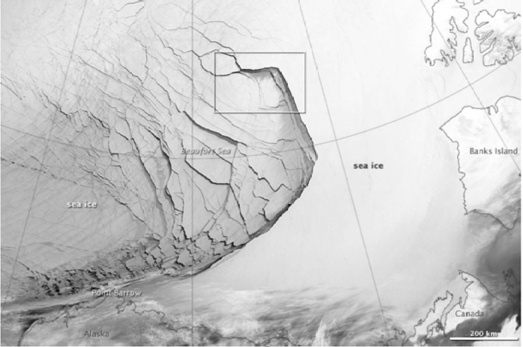

class:title-slide-custom

```{r, child = "style.Rmd"}
```


```{r setup, echo = FALSE, message = FALSE, warning = FALSE}
# Packages
library(emoji)
library(purrr)
library(tidyverse)
library(gridExtra)
library(nullabor)
library(scales)
library(knitr)
library(kableExtra)
library(RefManageR)
library(iconr)
library(fontawesome)
library(shiny)
# download_fontawesome()

# References
bib <- ReadBib("bib/thesis.bib", check = FALSE)
ui <- "- "

# R markdown options
knitr::opts_chunk$set(echo = FALSE, 
                      message = FALSE, 
                      warning = FALSE, 
                      cache = TRUE,
                      dpi = 300)
options(htmltools.dir.version = FALSE)
options(knitr.kable.NA = '')
```

```{r, include = F, eval = T, cache = T}
clean_file_name <- function(x) {
  basename(x) %>% str_remove("\\..*?$") %>% str_remove_all("[^[A-z0-9_]]")
}
img_modal <- function(src, alt = "", id = clean_file_name(src), other = "") {
  
  other_arg <- paste0("'", as.character(other), "'") %>%
    paste(names(other), ., sep = "=") %>%
    paste(collapse = " ")
  
  js <- glue::glue("<script>
        /* Get the modal*/
          var modal{id} = document.getElementById('modal{id}');
        /* Get the image and insert it inside the modal - use its 'alt' text as a caption*/
          var img{id} = document.getElementById('img{id}');
          var modalImg{id} = document.getElementById('imgmodal{id}');
          var captionText{id} = document.getElementById('caption{id}');
          img{id}.onclick = function(){{
            modal{id}.style.display = 'block';
            modalImg{id}.src = this.src;
            captionText{id}.innerHTML = this.alt;
          }}
          /* When the user clicks on the modalImg, close it*/
          modalImg{id}.onclick = function() {{
            modal{id}.style.display = 'none';
          }}
</script>")
  
  html <- glue::glue(
     " <!-- Trigger the Modal -->

<!-- The Modal -->
<div id='modal{id}' class='modal'>
  <!-- Modal Content (The Image) -->
  
  <!-- Modal Caption (Image Text) -->
  <div id='caption{id}' class='modal-caption'></div>
</div>
"
  )
  write(js, file = "js-addins.html", append = T)
  return(html)
}
# Clean the file out at the start of the compilation
write("", file = "js-addins.html")
```

<br><br><br>
# A Spatio-Temporal Model of Arctic Sea Ice
### PhD Comprehensive Exam, September 2, 2022
#### Alison Kleffner
#### Department of Statistics, University of Nebraska - Lincoln

<!-- ##### `r fa("envelope", fill = "black")` [akleffner@huskers.unl.edu](akleffner@huskers.unl.edu) -->
<!-- ##### `r fa("home", fill = "black")` [https://alison-kleffner.netlify.app/](https://alison-kleffner.netlify.app/) -->
<!-- ##### `r fa("github", fill = "black")` [alisonkleffner](https://github.com/alisonkleffner) -->
<!-- <br><br> -->
<!-- .medium[*Slides: https://bit.ly/3ENZmOZ*] -->
---
class:primary
# Outline


`r fa_i("arrows")` Motivation and Background

`r fa_i("list")` Research Objectives

`r fa_i("info")` Spatio-Temporal Clustering: Bounding Box

`r fa_i("info")` Spatio-Temporal Interpolation: Intersection Model

`r fa_i("ruler")` Simulation Study

`r fa_i("ruler")` Results with Ice Data

`r fa_i("check-double")` Overall conclusion

`r fa_i("spinner")` Future Work


---
class:inverse
<br>
<br>
<br>
<br>
<br>
<br>
<br>
<br>
.center[
# Motivation and Background
]

---
class:primary

# Arctic Sea Ice/Cracks - Why important

+ Sea ice is frozen sea water that can occur as an ice pack which drifts over the oceans surface
+ Cracks, or leads, may form in the ice pack due to dynamic processes
  - Allows for heat from the ocean to be transferred to the atmosphere `r Citep(bib[[c("schreyer_elastic_2006")]])`. 
+ Other Ice Crack Detection Methods
  - Involve the use of thermal images or deformation calculations found through satellite images `r Citep(bib[[c("key_detectability_1993", "peterson_evaluating_2011")]])`.
    + Satellite images can be low in resolution and are affected by atmospheric conditions `r Citep(bib[[c("willmes_pan-arctic_2015")]])`

```{r ice-pick, fig.align='center',  out.width="40%"}



```


---
class:primary

# Previous Methods


---
class:primary

# Data

.center[
```{r grid-pic,  results='asis', echo = F, include = T, cache = T, eval = TRUE}

#knitr::include_graphics("images/rgps_grid.png")

i1 <- img_modal(src = "images/rgps_grid.jpg", alt = " Grid Over Crack", other=list(width="40%"))

c(str_split(i1, "\\n", simplify = T)[1:2],
  str_split(i1, "\\n", simplify = T)[3:9]
  ) %>% paste(collapse = "\n") %>% cat()

```
]

---
class:primary

# Motivating Picture


---
class:primary

# Research Objectives


---
class:inverse
<br>
<br>
<br>
<br>
<br>
<br>
<br>
<br>
.center[
# Spatio-temporal Clustering: Bounding Box
]

---
class:inverse
<br>
<br>
<br>
<br>
<br>
<br>
<br>
<br>
.center[
# Spatio-temporal Interpolation: Model in Intersections
]


---
class:inverse
<br>
<br>
<br>
<br>
<br>
<br>
<br>
<br>
.center[
# Simulation Study
]

---
class:inverse
<br>
<br>
<br>
<br>
<br>
<br>
<br>
<br>
.center[
# Ice Data Results
]

---
class:inverse
<br>
<br>
<br>
<br>
<br>
<br>
<br>
<br>
.center[
# Discussion and Conclusion
]


---
class:primary
# Include columns

.pull-left[
**Bold text** 
].pull-right[
*Italic text*
]

---
class:primary
# Special text

**Math typeset**

$$y = \beta_0 + \beta_1 \cdot x$$

**Include in-text citations**

<!-- `r Citep(bib[[c("", "", "")]])`-->

<!-- `r Citet(bib[[c("", "", "")]])`-->

---
class:primary
# Include basic image

Can also use .png

.center[
```{r, out.width = "55%"}

```
]

---
class:primary
# Include popup images when clicked

```{r results='asis', echo = F, include = T, cache = T, eval = TRUE}
i1 <- img_modal(src = "images/example2.jpg", alt = "Alternative text description goes here.",other=list(width="50%"))

c(str_split(i1, "\\n", simplify = T)[1:2],
  str_split(i1, "\\n", simplify = T)[3:9]
  ) %>% paste(collapse = "\n") %>% cat()
```

```{r results='asis', echo = F, include = T, cache = T, eval = TRUE}
i1 <- img_modal(src = "images/example3.jpg", alt = "Alternative text description goes here.", other=list(width="30%"))
i2 <- img_modal(src = "images/example4.jpg", alt = "Alternative text description goes here.", other=list(width="30%"))
i3 <- img_modal(src = "images/example5.jpg", alt = "Alternative text description goes here.", other=list(width="30%"))

c(str_split(i1, "\\n", simplify = T)[1:2],
  str_split(i2, "\\n", simplify = T)[1:2],
  str_split(i3, "\\n", simplify = T)[1:2],
  str_split(i1, "\\n", simplify = T)[3:9],
  str_split(i2, "\\n", simplify = T)[3:9],
  str_split(i3, "\\n", simplify = T)[3:9]
  ) %>% paste(collapse = "\n") %>% cat()
```

---
class:primary
# References
<font size="2">
```{r, print_refs1, results='asis', echo=FALSE, warning=FALSE, message=FALSE}
print(bib[[c("")]], 
      .opts = list(check.entries = FALSE, style = "html", bib.style = "authoryear")
      )
```
</font>

---
class:inverse
<br>
<br>
<br>
.center[
# Questions?
<br>
<br>
`r fa("envelope", fill = "white")` **email.address@huskers.unl.edu**
`r fa("home", fill = "white")` **www.homepageurl.com**
`r fa("github", fill = "white")` **github-user-name**
]
